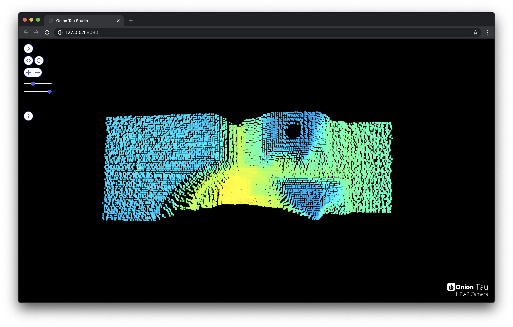

# Getting Started with the Onion Tau LiDAR Camera

This guide will help you set up your Tau LiDAR Camera for the first time. We’ll cover:

* [Unboxing your Tau Camera](#unbox-and-prep-the-tau-camera)
* [Installing the required software](#installing-software)
* [Connecting the Tau Camera to your computer](#using-the-tau-camera)
* [Using the Tau Studio web application](#using-the-tau-camera)

As well as:

* [Tips for Troubleshooting](#troubleshooting)
* [How to update the Tau Studio web app](#updating-tau-studio)

## First Time Setup

Steps you'll only need to do once!

### Unbox and Prep the Tau Camera

📦 Unpack the Tau Camera

📷 Make sure to remove the protective sticker from the lens

### Installing Software

To use the Tau Studio Web App, you'll need to have Python and TauLidarServer installed.

#### 🐍 Install python
Download and install Python at https://www.python.org/downloads/. **Make sure you install version 3.7 or higher**.

If you have questions about using Python, check out the [official Python.org  instructions](https://docs.python.org/3/using/index.html).

#### 📩 Install the `TauLidarServer` Python module

Open a command-line window, and run the following command:
`python -m pip install TauLidarServer`

#### 🥳 You're ready to use your Tau Camera!

## Using the Tau Camera

### 📸 Connecting the Tau Camera to your Computer

Use a USB cable to connect the Tau Camera to your computer. It has a USB Type-C port, so you'll need a compatible cable.

### ⚙️ Starting the Tau Studio Software

To start the Tau Studio Web App, run this in a command line window:

```
python -m TauLidarServer
```

If a Tau Camera is connected, you will see output like this:

```
ToF camera opened successfully:
    model:      4.0
    firmware:   3.3
    uid:        69.549
    resolution: 160x60
    port:       /dev/cu.usbmodem00000000001A1
    IP address: 127.0.0.1
    URL:  http://127.0.0.1:8080

Press Ctrl + C keys to shutdown ...
```

### 🖥 Using the Tau Studio web app

Use a **web browser** to navigate to the **URL** listed in the command line output from the last step! And you've arrived to the Tau Studio Web App



Hit the question mark button in the sidebar for more info on how to work with the Tau Studio

🍻 Have fun!

## Troubleshooting

A few troubleshooting tips in case you encounter any issues. So far we have troubleshooting tips for:

* [Bad frame ignored error -> Update your Tau Camera Software and try out a better cable](#bad-frame-ignored-error---update-your-tau-camera-software-and-try-out-a-better-cable)
* [Stuck on "Looking for connected Tau LiDAR Camera hardware" -> Update your Tau Camera Software and try some debugging steps](#stuck-on-looking-for-connected-tau-lidar-camera-hardware---update-your-tau-camera-software-and-try-some-debugging-steps)
* [ImportError: cannot import name 'resources' -> Update your Python Installation](#importerror-cannot-import-name-resources---update-your-python-installation)
* [Very slow frame rate -> Check your computer's serial ports, update BIOS](#very-slow-frame-rate---check-your-computers-serial-ports-update-bios)

If you run into an issue not mentioned here, get in touch on the [Onion Community Forum](https://community.onion.io/category/11/tau-camera-corner) and we'll do our best to help out.


### Bad frame ignored error -> Update your Tau Camera Software and try out a better cable

**The Problem:**

If you launch the Tau Studio and get an error in the command line that looks something like this:

```
Data error, actual size: 33788, expected size: 38480
Bad frame ignored, bytes length: 33708
skip frame
Bad frame ignored, bytes length: 0
skip frame
Bad frame ignored, bytes length: 0
skip frame
...
```

**The Solution:**

The first step will be to make sure you have the latest versions of the TauLidarServer and TauLidarCamera Python modules installed. A fix relating this this error was released in v0.0.4 of the TauLidarCamera module.

Run this command to update the Tau Camera software on your computer:

```
python -m pip install TauLidarServer --upgrade
python -m pip install TauLidarCamera --upgrade
```

**If you still have the same `Bad frame ignored` issue** after upgrading to the latest version, our experience points to a low-quality cable being the culprit. Here's a few things you can try:

1. Use ctrl+c to kill the program and try running it again
2. Unplug the Tau Camera from the computer for 10 seconds, reconnect, and try running the program again
3. Try switching to a **high-quality cable**! If possible, try using a not-super-long USB-C to USB-C cable from a reputable brand. Then try running the program again.

Try to avoid:

* Long cables
* USB hubs
* USB adapters

Try to use:

* Shorter cables
* Direct USB-C to USB-C if possible
* Cables from reputable brands

### Stuck on "Looking for connected Tau LiDAR Camera hardware" -> Update your Tau Camera Software and try some debugging steps

**The Problem:**

If you launch the Tau Studio (or the [example Python programs](https://github.com/OnionIoT/tau-lidar-camera/tree/master/examples)) and the program just shows this line and stays there indefinitely:

```
Looking for connected Tau LiDAR Camera hardware ...
```

**The Solution:**

The first step will be to make sure you have the latest versions of the TauLidarServer and TauLidarCamera Python modules installed. A fix relating this this error was released in v0.0.5 of the TauLidarCamera module.

Run this command to update the Tau Camera software on your computer:

```
python -m pip install TauLidarServer --upgrade
python -m pip install TauLidarCamera --upgrade
```

**If you still have the same issue** after upgrading to the latest version, you'll want to take a few actions to further debug the issue. We'll be using the [`checkCamera.py` example Python program](https://github.com/OnionIoT/tau-lidar-camera/tree/master/examples#checkcamerapy-program) to help us out here:

1. If you haven't already, install the pre-requisites for the example program by following the instructions [here](https://github.com/OnionIoT/tau-lidar-camera/tree/master/examples#checkcamerapy-program)
2. Try running the `checkCamera.py` program in [mode 1]((https://github.com/OnionIoT/tau-lidar-camera/tree/master/examples#mode-1---scanning-all-ports)) where it scans all serial ports for Tau Camera hardware. Details [here](https://github.com/OnionIoT/tau-lidar-camera/tree/master/examples#mode-1---scanning-all-ports).
    * If the program hangs or doesn't find any connected Tau Cameras when it actually should, move on to step 3
3. Run the `checkCamera.py` program in [mode 2](https://github.com/OnionIoT/tau-lidar-camera/tree/master/examples#mode-2---specifying-a-port) where you specify the serial port for the connected Tau Camera (details [here](https://github.com/OnionIoT/tau-lidar-camera/tree/master/examples#mode-1---scanning-all-ports)). Note that you'll need to have an idea of which serial port on your computer is connected to the Tau Camera.
4. Get in touch with us if either or both steps 2 and 3 don't work out and we'll do our best to look into the problem. You can let us know by posting on the [Onion Community Forum](https://community.onion.io/category/11/tau-camera-corner) or [submitting a bug report on GitHub](https://github.com/OnionIoT/tau-lidar-camera/issues/new/choose).

### ImportError: cannot import name 'resources' -> Update your Python Installation

**The Problem:**

If you launch the Tau Studio and get an error in the command line that looks something like this:

```
Traceback (most recent call last):
  File "C:\Users\user\AppData\Local\Programs\Python\Python36\lib\runpy.py", line 193, in _run_module_as_main
    "__main__", mod_spec)
  File "C:\Users\user\AppData\Local\Programs\Python\Python36\lib\runpy.py", line 85, in _run_code
    exec(code, run_globals)
  File "C:\Users\user\AppData\Local\Programs\Python\Python36\lib\site-packages\TauLidarServer\__main__.py", line 4, in <module>
    from importlib import resources  # Python 3.7+
ImportError: cannot import name 'resources'
```

**The Solution:**

It's likely that you need to update your Python installation. Remember that Tau Studio needs Python 3.7 or higher.

Check the version of your Python installation by running:

```
python -V
```

If the version printed is below `3.7`, you will need to update!

### Very slow frame rate -> Check your computer's serial ports, update BIOS

**The Problem:**

A visibly slow frame rate coming from the Tau Camera. Lots of time between frames.

**The Solution:**

The Tau Camera should be able to send frames to your computer at a rate of around 30 fps.

We've found that USB issues on the host computer can negatively impact the frame rate. This has been confirmed for Lenovo ThinkPad computers (more info (here)[https://support.lenovo.com/ca/en/solutions/ht080247-troubleshooting-usb-devices-thinkpad]).

To resolve the issue, try updating your computer's BIOS.

## Updating Tau Studio

Since Tau Studio is a Python module, it's very straight-forward to update it!

Open a command-line window and run this command:

```
python -m pip install TauLidarServer --upgrade
```
