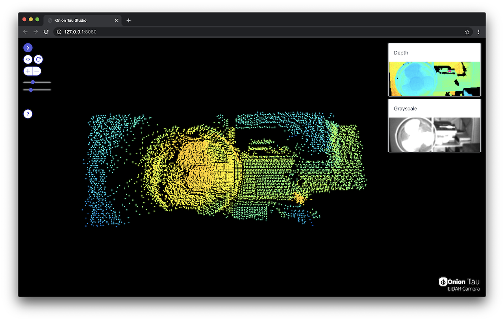

# Getting Started with the Onion Tau LiDAR Camera

This guide will help you set up your Tau LiDAR for the first time. We’ll cover:

* Installing the required software
* Connecting the Tau Camera to your computer
* Using the software

## First Time Setup

Steps you'll only need to do once!

### Unbox and Prep the Tau Camera

Unpack the Tau Camera

Make sure to remove the protective sticker from the lens

### Installing Software

To use the Tau Studio Web App, you'll need to have Python installed.

1. Follow [the official Python.org instructions](https://docs.python.org/3/using/index.html) to install Python on your machine. **Make sure you install version 3.6.1 or higher.**
2. Install the `TauLidarServer` Python module using [pip, the Python package manager](https://pip.pypa.io/en/stable/) in a command line window, run: `python -m pip install TauLidarServer`

## Using the Tau Camera

### Connecting the Tau Camera to your Computer

Use a USB cable to connect the Tau Camera to your computer. It has a USB Type-C port, so you'll need a compatible cable.

TODO: photo of connected Tau Camera

### Using the Software

To start the Tau Studio Web App, run this in a command line window:

```
python -m TauLidarServer
```

If a Tau Camera is connected, you will see output like this:

```
ToF camera opened successfully:
    model:      4.0
    firmware:   3.3
    uid:        69.549
    resolution: 160x60
    port:       /dev/cu.usbmodem00000000001A1
    IP address: 127.0.0.1
    URL:  http://127.0.0.1:8080

Press Ctrl + C keys to shutdown ...
```

Use a **web browser** to navigate to the URL listed in the command line output! And you've arrived to the Tau Studio Web App


